# 9.3 - Data Modeling

## Overview

Today's class will focus on data modeling and best practices for designing a database. Students will learn how to normalize data and how tables in a database are related, as well as how to create visualizations of databases using entity relationship diagrams (ERDs).

## Class Objectives

By the end of today's class, students will be able to:

* Apply data modeling techniques to database design.
* Normalize data.
* Identify data relationships.
* Create visual representations of a database through entity relationship diagrams.

## Instructor Prep

<details>
  <summary><strong>Instructor Notes</strong></summary>

* You may find that this lesson falls on a weekday due to a holiday shifting the course schedule. In this case, we have provided notes within the LP that will allow you to **easily adjust the length of the lesson to fit into a weekday class**.

  * Be on the lookout for a **3-Hour Adjustment** note at the top of activities in this Lesson Plan. If this class is being taught on a weekday, please utilize the directions found in the note. Keep in mind that breaks will be reduced from 40 minutes to the typical 15 minutes for a weekday class as well.

  * Shortening these activities could potentially limit the students' ability to finish them, so please remind them to utilize office hours to clear up any questions they may have.

* This lesson is less heavy on pure SQL, which will be used mainly to supplement the ideas presented today. If students continue to struggle with SQL basics, encourage them to practice on their own while still focusing on the concepts in this lesson.

* The TAs should be ready to help explain and break down concepts for students struggling to grasp the material.

* Please reference our [Student FAQ](../../../05-Instructor-Resources/README.md#unit-09-sql) for answers to questions frequently asked by students of this program. If you have any recommendations for additional questions, feel free to log an issue or a pull request with your desired additions.

* Have your TAs refer to the [Time Tracker](TimeTracker.xlsx) to stay on track.

* Lastly, as a reminder these slideshows are for instructor use only - when distributing slides to students, please first export the slides to a PDF file. You may then distribute the PDF file through Slack.

</details>

<details>
  <summary><strong>Sample Class Video</strong></summary>

* To view an example class lecture visit (Note video may not reflect latest lesson plan): [Class Video](https://codingbootcamp.hosted.panopto.com/Panopto/Pages/Viewer.aspx?id=b1b3ea0c-00ea-42b0-aaa6-aa6b0184e94b)

</details>

- - -

# Class Activities

## 1. Instructor Presentation

| Activity Time:       0:20 |  Elapsed Time:      0:20  |
|---------------------------|---------------------------|

<details>
  <summary><strong>  📣 1.1 Instructor Do: Welcome Class (0:05)
  </strong></summary>

* Welcome students and explain that today's lesson will dive into data modeling techniques such as normalization, relationships, and how to conceptualize database design using entity relationship diagrams (ERDs).

* Open the [slideshow](https://docs.google.com/presentation/d/1X72l_-j7OKOaploPA-8hLjoEn0e0O0iNHaVaty4qJxs/edit?usp=sharing) and use slides 1 and 2 and go over the class objectives.

</details>

<details>
  <summary><strong> 📣 1.2 Instructor Do: Data Normalization (Slides 3–11) (0:15)</strong></summary>

* **File:** [Normalization.md](Activities/01-Ins_Data_Normalization/Solved/Normalization.md)

* Open the [slideshow](https://docs.google.com/presentation/d/1X72l_-j7OKOaploPA-8hLjoEn0e0O0iNHaVaty4qJxs/edit?usp=sharing) and use slides 3-12 on data normalization, explaining the following:

  * Data normalization is the process of restructuring data to a set of defined "normal forms."

  * The process of data normalization eliminates data redundancy and inconsistencies.

  * We will be covering the three main forms of normalization, though additional forms exist.

  * In *first normal form*, or 1NF, each row contains a single value, and each row is unique. In this example, each family's children are all listed in one row. The data is normalized into 1NF by creating a new row for each child.

  * In *second normal form*, or 2NF, the data is in 1NF. Additionally, all non-key columns are dependent on the primary key for the table. In this example, there are two tables. The Family table has the primary key `parent_id`, and the Child table has the primary key `child_id`.

  * Notice that `family_id` is added to the Child table. Since this is not a primary key, there can be non-unique values that relate to the Family table.

  * *Transitive dependency* is a column value's reliance on another column through a third column. The transitive property states that if X > Y and Y > Z, then we can infer that X > Z. Dependence means that one value relies on another, such as city on ZIP code, or age on birthday.

  * For example, let's say that a table has three columns: `StoreName`, `OwnerAddress`, and `OwnerName`.  `OwnerName` and `OwnerAddress` rely on `StoreName`. `OwnerAddress` also depends on `OwnerName`. So `OwnerAddress` is transitively dependent on `StoreName` through `OwnerName`.

  * *Third normal form*, or 3NF, has the data normalized to second form and contains non-transitively-dependent columns.

  * In the previous example, two tables are created. The Owners table has the `OwnerName` and `OwnerAddress`, both of which depend only on the `owner_id`. The Stores table contains the `store_name`, which is dependent on the primary key `store_id`. The Stores table also contains an `owner_id` that creates a relationship with the Owners table.

* Note that students may find 3NF a bit confusing. Encourage students to learn more about 3NF on their own. Today's lesson will mainly focus on 1NF and 2NF.

* Slack out [Normalization.md](Activities/01-Ins_Data_Normalization/Solved/Normalization.md) as a cheat sheet for students before moving on.

</details>

- - -

## 2. Pet Normalizer

| Activity Time:       0:20 |  Elapsed Time:      0:40  |
|---------------------------|---------------------------|

**⏰ 3-Hour Adjustment**: Change to Everyone Do

<details>
  <summary><strong>✏️ 2.1 Student Do: Pet Normalizer (0:15)</strong></summary>

* Open the [slideshow](https://docs.google.com/presentation/d/1X72l_-j7OKOaploPA-8hLjoEn0e0O0iNHaVaty4qJxs/edit?usp=sharing) and use slides 13-14 to go over this activity.

* In this activity, students will practice their data normalization skills using the provided data.

  * **File:** [pets.csv](Activities/02-Stu_Data_Normalization/Resources/pets.csv)

  * **Instructions:** [README.md](Activities/02-Stu_Data_Normalization/README.md)

</details>

<details>
  <summary><strong>⭐ 2.2 Review: Pet Normalizer (0:05)</strong></summary>

* Open the [slideshow](https://docs.google.com/presentation/d/1X72l_-j7OKOaploPA-8hLjoEn0e0O0iNHaVaty4qJxs/edit?usp=sharing) and use slide 15 to review the activity.

* Open [pets.csv](Activities/02-Stu_Data_Normalization/Resources/pets.csv) and explain the first step of normalization:

  * Make sure multiple data points are not included in the same column. For columns containing multiple pets, a new row will need to be created for each pet.

  * The final product will look like [pets_cleaned.csv](Activities/02-Stu_Data_Normalization/Resources/pets_cleaned.csv).

* Next, open [schema.sql](Activities/02-Stu_Data_Normalization/Solved/schema.sql) in pgAdmin. Walk through the code and explain the following:

  * Second normal form requires the data to be in first normal form, which was accomplished in the previous step.

  * All non-ID columns are dependent on the primary key.

  * The `owners` table will include each owner name once, which is dependent on the primary key for the table.

  * Next, a `pet_names` table is created, with each pet given a name and two IDs: one unique `id` for the pet itself and an `owner_id` that will link each pet to its correct owner.

  * Each table has values that depend on the primary key and are not repeated in the other table.

  * Finally, the two tables can be joined by connecting the `owners` table on `id` and the `pet_names` table on `owner_id`.

* Explain the bonus section of the activity:

  * A `service` table is created and data is inserted, each with a unique `service_type` and `id`.

  * A new `pets_name_new` table is created, this time adding a `service_id` for each animal.

  * All three tables can be joined to replicate a view of the cleaned CSV.

</details>

<sub>[Having issues with this activity? Report a bug!](https://bit.ly/2JD9myU)</sub>

- - -

## 3. Foreign Keys

| Activity Time:       0:35 |  Elapsed Time:      1:15  |
|---------------------------|---------------------------|

<details>
  <summary><strong>📣 3.1 Instructor Do: Intro to Foreign Keys (0:15)</strong></summary>

* Open the [slideshow](https://docs.google.com/presentation/d/1X72l_-j7OKOaploPA-8hLjoEn0e0O0iNHaVaty4qJxs/edit?usp=sharing) and use slides 16 and 17 to cover foreign Keys.

* **File:** [schema.sql](Activities/03-Ins_Foreign_Keys/Solved/schema.sql)

* Use the slideshow to explain the concept of foreign keys and how they are used to connect tables:

  * A foreign key is a link between tables. The foreign key in the first table points to, or is linked to, the primary key in a second table.

  * A foreign key also prevents invalid data from being entered into a column. The data being entered MUST be a value from the referenced column.

* Slack out [schema.sql](Activities/03-Ins_Foreign_Keys/Solved/schema.sql) for students to follow along. Walk through the code, explaining the following steps:

  * Create a table named `animals_all` and set the primary key to `id`, which will be auto-populated and incremented with each new entry.

    ```sql
    CREATE TABLE animals_all (
      id SERIAL PRIMARY KEY,
      animal_species VARCHAR(30) NOT NULL,
      owner_name VARCHAR(30) NOT NULL
    );
    ```

  * Insert data into the `animals_all` table, and then run a `SELECT` query to double-check that data has been inserted.

    ```sql
    INSERT INTO animals_all (animal_species, owner_name)
    VALUES
    ("Dog", "Bob"),
    ("Fish", "Bob"),
    ("Cat", "Kelly"),
    ("Dolphin", "Aquaman");

    SELECT * FROM animals_all;
    ```

  * Point out that a new table is created, and its primary key is labeled `id`. The `id` will be unique to this table and has no relation to the previously created table.

    

  * A new table named `animals_location` is created. The `FOREIGN KEY (animal_id)` identifies the `animal_id` column as a foreign key.

  * After the foreign key has been identified, `REFERENCES animals_all(id)` tells the table that `animal_id` references, or is linked to, the `id` column in the `animals_all` table.

    ```sql
    CREATE TABLE animals_location (
    id INTEGER(11) AUTO_INCREMENT NOT NULL,
    location VARCHAR(30) NOT NULL,
    animal_id INTEGER(10) NOT NULL,
    PRIMARY KEY (id),
    FOREIGN KEY (animal_id) REFERENCES animals_all(id)
    );
    ```

  * The table is then populated with data and checked with a `SELECT ALL` query.

    

* Recap the following:

  * The `id` column is the primary key of the `animals_all` table, while `animal_id` is a foreign key in the `animals_location` table.

  * Both the `id` column in `animals_all` and the `animal_id` in `animals_location` are designed to contain the same data (the ID), even though the names are different.

  * SQL will throw an error if an attempt is made to change an `id` in one table but not the other.

  * Foreign key columns need to be named appropriately in order to clarify the data they are referring to.

* Students should now understand how to create foreign keys, as well as how to use them to reference data in other tables. Use the following example to illustrate the importance of foreign keys:

  * Foreign keys allow tables to be consistent and avoid issues caused by inserting, deleting, or updating one table without making those same changes in the other tables.

  * When attempting to insert a row into the new table with an `id` that does not exist in the other table, an error will be returned.

    ```sql
    INSERT INTO animals_location (location, animal_id)
    VALUES ('River', 5);
    ```

  * Explain that the `animal_id` column is a foreign key that is assigned to the `id` column in the `animals_all` table. The `id` 5 doesn't exist in the `animals_all` table and therefore can't be referenced in the `animals_location` table.

  * Next, a new row is inserted into `animals_all` that will have an `id` of 5. Now a row can be inserted into `animals_location` with an `id` of 5 because it corresponds with an `id` in the `animals_all` table.

    ```sql
    INSERT INTO animals_all (animal_species, owner_name)
    VALUES
      ('Fish', 'Dave');

    INSERT INTO animals_location (location, animal_id)
    VALUES
      ('River', 5);
    ```

  * Check that the row was inserted using a `SELECT * FROM animal_location` query.

    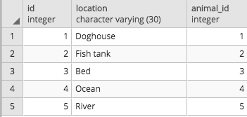

* Answer any questions students have about foreign keys. Then ask students if they can think of other real-world cases in which the use of foreign keys makes sense. Here are two examples:

  * States and countries in addresses: Tell students to think back to the `rental` database, where streets, addresses, cities, and countries were stored in different tables. So, for example, if a change occurs to the address of a customer, all information across all tables would need to change. This is called maintaining the *referential integrity*.

  * ID number of employees: In a database where the ID number of an employee is used in multiple tables, what happens if the employee's ID number changes? The ID number would need to be changed across all the tables that contain it.

* Emphasize that using foreign keys to build relationships across data is a feature of relational databases, hence the name.

</details>

<details>
  <summary><strong>✏️ 3.2 Student Do: Foreign Keys (0:15)</strong></summary>

* Open the [slideshow](https://docs.google.com/presentation/d/1X72l_-j7OKOaploPA-8hLjoEn0e0O0iNHaVaty4qJxs/edit?usp=sharing) and use slides 18 and 19 to instruct students how to create tables with foreign keys.

  * **File**: [schema.sql](Activities/04-Stu_Foreign_Keys/Unsolved/schema.sql)

  * **Instructions:** [README.md](Activities/04-Stu_Foreign_Keys/README.md)

</details>

<details>
  <summary><strong>⭐ 3.3  Review: Foreign Keys (0:05)</strong></summary>

* **File**: [schema.sql](Activities/04-Stu_Foreign_Keys/Solved/schema.sql)

* Open the [slideshow](https://docs.google.com/presentation/d/1X72l_-j7OKOaploPA-8hLjoEn0e0O0iNHaVaty4qJxs/edit?usp=sharing) and use slide 20 to review the activity.

* Open `schema.sql` in pgAdmin and walk through the code, explaining the following:

  * Create a table named `customer`.

    ```sql
    CREATE TABLE customer (
        id SERIAL,
        first_name VARCHAR(30) NOT NULL,
        last_name VARCHAR(30) NOT NULL,
        PRIMARY KEY (id)
    );
    ```

  * Data is inserted that takes only `first_name` and `last_name` as values because the `id` will automatically be added.

  * Create a table named `customer_email`.

    ```sql
    CREATE TABLE customer_email (
        id SERIAL,
        email VARCHAR(30) NOT NULL,
        customer_id INTEGER NOT NULL,
        PRIMARY KEY (id),
        FOREIGN KEY (customer_id) REFERENCES customer(id)
    );
    ```

  * The `customer_id` is a foreign key that references the `id` of the `customer` table. All data inserted must have an `id` that is in the `customer` table.

  * The `customer_phone` table is also created and references the same column as its foreign key:

    ```sql
    CREATE TABLE customer_phone (
        id SERIAL,
        phone VARCHAR(30) NOT NULL,
        customer_id INTEGER NOT NULL,
        PRIMARY KEY (id),
        FOREIGN KEY (customer_id) REFERENCES customer(id)
    );
    ```

  * Data is inserted into the `customer_phone` table. Like the `customer_email` table, the `customer_id` is a foreign key that references the `id` of the `customer` table.

* To test if we have the correct foreign keys, we can attempt to insert a value with an `id` of 10. Uncomment the code:

  ```sql
  -- INSERT INTO customer_phone(customer_id, phone)
  -- VALUES
    -- (10, '555-444-3333');
  ```

* Then run the `INSERT` statement. Explain:

  * This returns an error because that `id` does not exist in the `customer` table.

* Finally explain that all tables can be joined together by their respective IDs.

</details>

<sub>[Having issues with this activity? Report a bug!](https://bit.ly/2xI1pWG)</sub>

- - -

## 4. Data Relationships

| Activity Time:       0:35 |  Elapsed Time:      1:50  |
|---------------------------|---------------------------|

<details>
  <summary><strong>📣 4.1 Instructor Do: Intro to Data Relationships (0:15)</strong></summary>

* Open the [slideshow](https://docs.google.com/presentation/d/1X72l_-j7OKOaploPA-8hLjoEn0e0O0iNHaVaty4qJxs/edit?usp=sharing) and use slides 21 to 27 to present this lesson.

* **Files:**

  * [schema.sql](Activities/05-Ins_Data_Relationships/Solved/schema.sql)

  * [query.sql](Activities/05-Ins_Data_Relationships/Solved/query.sql)

* Open the [slideshow](https://docs.google.com/presentation/d/1I4a3pxfj10njDK6DdJn5NnIetR0xHIWSWP_s00pqLs0). Explain that we will now cover one-to-one, one-to-many, and many-to-many relationships between data, which is an essential part of data modeling.

* Begin by discussing one-to-one relationships. This example will use members of the Simpson family to illustrate the concept.

* In a one-to-one relationship, each name is associated with one and only one Social Security number. In other words, each item in a column is linked to only one item from another column.

  

* Next, discuss one-to-many relationships. We'll continue with our Simpsons example, but add Sherlock Holmes and his sidekick Watson to the database.

  

  * This example has two tables. The first table lists only addresses. The second table lists each person's Social Security number and address.
  * As before, one Social Security number is unique to one individual.

* Each individual has one address; however, a single address can be shared between multiple individuals. The Simpson family has a shared address at `742 Evergreen Terrace`, while Sherlock and Watson share the `221B Baker Street` address.

  * In a one-to-many relationship, the data from one table can be repeated for items in another table.
  * Ask students to think of another example of real-life one-to-many relationships.
  * One possible example is a purchase order with an internet company. Each order has a unique identifying number. A customer might be associated with multiple orders, but each order is associated with one and only one customer.

* Discuss many-to-many relationships. Continuing with our Simpsons example, there are three children (Lisa, Bart, and Maggie), and two parents (Homer and Marge).

  

* In this case, there are two tables: one for children and another for parents.

* Each child here has many parents, and each parent has many children. Each child has a separate row for each parent and vice versa.

  

* Explain that many-to-many relationships require a separate table, called a *junction table*, to show the relationships.

  * Ask the class what many-to-many relationships might be found in an online retailer database such as Amazon's.
  * A customer can order many different items, and many different customers can order each item.

* Demonstrate the creation of a junction table in Postgres. First, open [schema.sql](Activities/05-Ins_Data_Relationships/Solved/schema.sql) and paste in the queries to create and insert into the `children` and `parents` tables. There are two separate tables:

  

  

* Now walk through the junction table schema:

  ```sql
  CREATE TABLE child_parent (
    child_id INTEGER NOT NULL,
    FOREIGN KEY (child_id) REFERENCES children(child_id),
    parent_id INTEGER NOT NULL,
    FOREIGN KEY (parent_id) REFERENCES parents(parent_id),
    PRIMARY KEY (child_id, parent_id)
  );
  ```

  * The `child_id` and `parent_id` columns are both linked to the previously created tables as foreign keys.

  * Additionally, the primary key in this table is a *composite key*, made up of both the `child_id` and `parent_id` keys. This means that the unique identifier for a row is not a single column, but rather the composite of both columns.

* Show the junction table:

  

* Finally, go through the `JOIN` query to display the data in full:

  

  ```sql
  SELECT children.child_name, child_parent_junction.child_id,
  parents.parent_name, child_parent_junction.parent_id
  FROM children
  LEFT JOIN child_parent_junction
  ON child_parent.child_id = children.child_id
  LEFT JOIN parents
  ON child_parent_junction.parent_id = parents.parent_id;
  ```

  * The `children` table has a left join with the junction table, the results of which then have a left join with the `parents` table.

* Take a moment to summarize the major points of the activity:

  * Data can be modeled as one-to-one, one-to-many, and many-to-many relationships.

  * Many-to-many relationships require a junction table.

  * Junction tables use foreign keys to reference the keys in the original tables.

</details>

<details>
  <summary><strong>✏️ 4.2 Student Do: Data Relationships (0:15)</strong></summary>

* Open the [slideshow](https://docs.google.com/presentation/d/1X72l_-j7OKOaploPA-8hLjoEn0e0O0iNHaVaty4qJxs/edit?usp=sharing) and use slides 28 and 29 to instruct students for this activity.

* In this activity, students will create table schemata for students and available courses, and then create a junction table to display all courses taken by students.

  * **Instructions:** [README.md](Activities/06-Stu_Data_Relationships/README.md)

</details>

<details>
  <summary><strong>⭐ 4.3 Review: Data Relationships (0:05)</strong></summary>

* Open the [slideshow](https://docs.google.com/presentation/d/1X72l_-j7OKOaploPA-8hLjoEn0e0O0iNHaVaty4qJxs/edit?usp=sharing) and use slide 30 to review the activity.

* **Files:**

  * [schema.sql](Activities/06-Stu_Data_Relationships/Solved/schema.sql)

  * [query.sql](Activities/06-Stu_Data_Relationships/Solved/query.sql)

* Explain that this activity required creating separate tables for students and courses, and then creating a junction table to reflect the many-to-many relationship between the two tables.

* Paste in the schemata for the `students` and `courses` tables and explain the following:

  * Each table is given the ID as the primary key.

  * Fields are added for required attributes for the table.

  * Populate the tables with the `INSERT` queries, and then display the tables.

  

  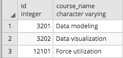

* Next, do the same for the junction table, named `student_courses_junction`, and explain the following:

  ```sql
  -- Create a junction table.
  CREATE TABLE student_courses_junction (
    student_id INTEGER NOT NULL,
    FOREIGN KEY (student_id) REFERENCES students(id),
    course_id INTEGER NOT NULL,
    FOREIGN KEY (course_id) REFERENCES courses(id),
    course_term VARCHAR NOT NULL,
    PRIMARY KEY (student_id, course_id)
  );
  ```

  * The table takes both a `student_id` and a `course_id`, which are references to the previously created tables.

  * Since `student_id` and `course_id` reference those tables, they become the foreign key.

  * New student or course data cannot be inserted into the `student_courses_junction` table that does not currently exist in the `students` or `courses` tables.

  * This table bridges the two previous tables and shows all courses taken by each student.

  * The primary key will be a composite of both IDs.

  * Additionally, this table includes a new field, `course_term`, which is the term in which a course was taken by a student.

* Query the table to display the result.

  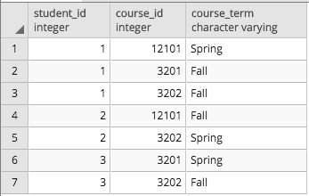

* To reinforce the many-to-many relationship, point out that many students can take many courses.

* For the bonus, briefly explain that two outer joins can be performed to retrieve complete data on each student.

  ```sql
  SELECT s.id, s.last_name, s.first_name, c.id, c.course_name, j.course_term
  FROM students s
  LEFT JOIN student_courses_junction j
  ON s.id = j.student_id
  LEFT JOIN courses c
  ON c.id = j.course_id;
  ```

  

</details>

<sub>[Having issues with this activity? Report a bug!](https://bit.ly/39MeUSB)</sub>

- - -

## Break

| Activity Time:       0:40 |  Elapsed Time:      2:30  |
|---------------------------|---------------------------|

**⏰ 3-Hour Adjustment**: Reduce break time to 15 minutes.

- - -

## 5. Entity Relationship Diagrams

| Activity Time:       0:55 |  Elapsed Time:      3:25  |
|---------------------------|---------------------------|

**⏰ 3-Hour Adjustment**: Change activities to Everyone Do and reduce to 10 minutes each.

<details>
  <summary><strong>📣 5.1 Instructor Do: Entity Relationship Diagrams (Slides 28–31) (0:15)</strong></summary>

* Open the [slideshow](https://docs.google.com/presentation/d/1X72l_-j7OKOaploPA-8hLjoEn0e0O0iNHaVaty4qJxs/edit?usp=sharing) and use slides 32 to 37 to present this lesson.

* **Files:**

  * [slideshow](https://docs.google.com/presentation/d/1I4a3pxfj10njDK6DdJn5NnIetR0xHIWSWP_s00pqLs0)

  * [pagila-erd.png](Images/pagila-erd.png)

  * [conceptual_schema.txt](Activities/07-Ins_ERD/Solved/conceptual_schema.txt)

  * [logical_schema.txt](Activities/07-Ins_ERD/Solved/logical_schema.txt)

  * [physical_schema.txt](Activities/07-Ins_ERD/Solved/physical_schema.txt)

* Revisit the slideshow and begin the discussion of entity relationship diagrams (ERDs). Explain the following points:

  * An **entity relationship diagram**, or **ERD**, is a visual representation of entity relationships within a database.

  * ERDs use certain notation to describes different parts of the diagram. Boxes are represent Entities, ovals represent Attributes and lines represent relationships. Lines will contain differences, such as branching out, that represents different relationship. ERDs can contain more complicated information but the basics will still be the same.

  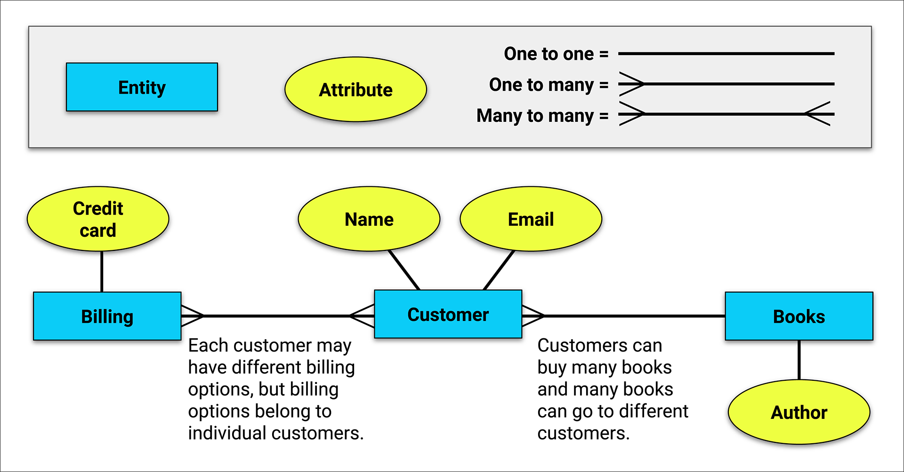

  * ERDs are commonly interchanged with the term **data model**, as an ERD describes the relationships of tables within a database and therefore describes a model of a potential database.

  * An ERD defines entities, their attributes, and data types, as well as illustrates the overall design of a database.

  * There are three types of ERDs or data models: **conceptual**, **logical**, and **physical**. As the following image demonstrates, a conceptual data model is the simplest form, describing only entity names and relationships; a logical database model further expands upon the conceptual data model by additionally describing attributes or column names as well as primary and foreign key definitions; a physical data expands upon the logical data model to additionally include column data types and specific naming conventions.

  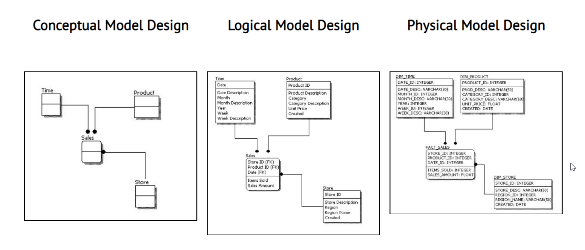

  * Logical and physical models will also display the cardinality of the tables, or the direction and number of relationships in that direction. Such as one-to-one, one-to-many, and many-to-many.

* To break down these concepts further, discuss the following example.

  * In a database, the table is an *entity*; the data contained within the table are *attributes*; and the data type specified could be one of many things, such as Booleans, integers, or varying characters.

  * In an entity relationship diagram, the relationships between entities, or tables, are given a visual representation. This allows clear and concise joins between tables as well as a deeper understanding of the data contained within a database as a whole.

  * ERDs are used both to document existing databases and to aid in the creation of new databases.

* Open [Quick Database Diagrams (Quick DBD)](https://app.quickdatabasediagrams.com/#/) and briefly explain its components.

  **Note:** If this is the first time you are visiting the site, exit from the tour and clear the text on the left. If the site requires a sign-in, do so using your GitHub account.

  * The pane on the left of the window is where users insert the text used to create the entities of a database.

  * The blue text signifies the name of the table containing the entities in a database.

  * The white pane to the right is where the diagram is drawn, based on the text entered in the left pane.

    

  * Once a diagram has been finalized, it can be exported in many formats from the **Export** tab at the top of the page.

    

    **Note**: When exporting the diagram as **PostgreSQL**, the table schemata can be automatically generated, but note that the exported sql syntax will be slightly different than the traditional SQL syntax taught in these activities.

* With the design tool open in your browser, demonstrate how to create a simple conceptual ERD using the following text:

  ```sql
  Employee
  -

  Zipcode
  -

  Employee_Email
  -

  Owners
  -

  Estates
  -

  Estate_Type
  -

  Agents
  -

  Regions
  -

  Agent_Region_Junction
  -
  ```

* The result should appear as follows:

    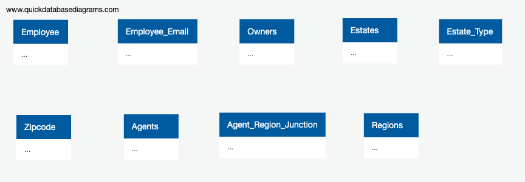

    **Note**: The tables' locations can be physically adjusted by clicking and dragging them in the browser.

* Explain to the class that at this point, the conceptual data model contains entities; however, it does not describe any entity relationships. In order to create the relationships between tables, use the `rel <entity-name>` syntax to create abstract relationships between tables.

  ```sql
  Employee
  rel Zipcode
  -

  Zipcode
  -

  Employee_Email
  rel Employee
  -

  Owners
  -

  Estates
  rel Owners
  rel Estate_Type
  rel Zipcode
  -

  Estate_Type
  -

  Agents
  -

  Regions
  -

  Agent_Region_Junction
  rel Agents
  rel Regions
  -
  ```

* The results should now appear as follows:

  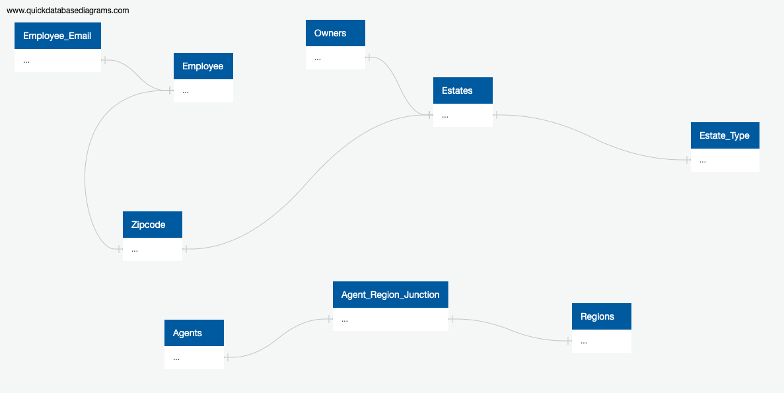

* Explain that to transition from the conceptual ERD to a logical ERD, entity attributes, or column, need to be added to the diagram. Using the following lines, update your current entities with columns using the Quick Database Diagrams tool.

    ```sql
  Employee
  rel Zipcode
  -
  employee_id
  name
  age
  address
  zip_code

  Zipcode
  -
  zip_code
  city
  state

  Employee_Email
  rel Employee
  -
  email_id
  employee_id
  email

  Owners
  -
  owner_id
  first_name
  last_name

  Estates
  rel Owners
  rel Estate_Type
  rel Zipcode
  -
  estate_id
  owner_id
  estate_type
  address
  zip_code

  Estate_Type
  -
  estate_type_id
  estate_type

  Agents
  -
  agent_id
  first_name
  last_name

  Regions
  -
  region_id
  region_name

  Agent_Region_Junction
  rel Agents
  rel Regions
  -
  agent_id
  region_id
  ```

* The result should appear as follows:

  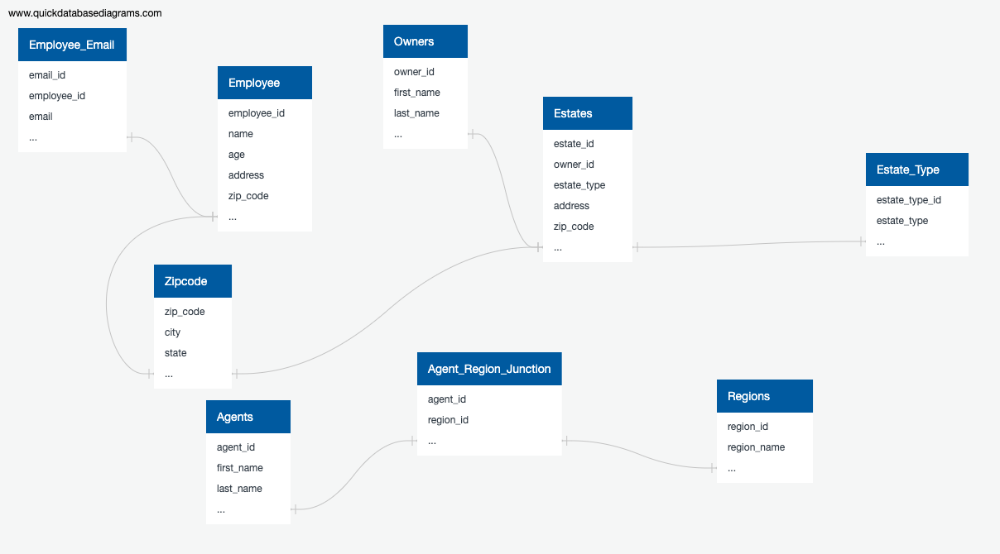

* Explain that the data model now contains column names but is not yet quite a full-fledged logical data model. This is because;

  * We need to continue to add in the foreign key relationships to represent the *types* of entity relationships in the diagram.

  * Define the primary keys for the tables. As of this point, the `rel <entity-name>` syntax only describes abstract relationships between tables.

* Primary and foreign keys can be defined in the online diagram tool by using the `PK` and `FK` syntax after the attribute names of a table.

  ```sql
  Employee
  -
  employee_id PK
  name
  age
  address
  zip_code FK
  ```

* The following syntax should be added to point the foreign key definition to the specific column of another table.

  ```sql
  Employee
  -
  employee_id PK
  name
  age
  address
  zip_code FK - Zipcode.zip_code
  ```

* In the line containing `FK - `, the hyphen signifies a one-to-one relationship between the `Employee` and `Zipcode` tables, where each zip code in the `Employee` table is linked to one zip code in the `Zipcode` table.

* Many types of relationships between entities can be illustrated with various symbols. For example, the `Employee_Email` table has a many-to-one relationship with the `Employee` table via the common employee_id (an employee can have multiple email addresses). Therefore, the symbol describing the relationship is `>-`.

  

  ```sql
  Employee_Email
  -
  email_id PK
  employee_id FK >- Employee.employee_id
  email
  ```

* The complete schema for the logical data model should be as follows:

  ```sql
  Employee
  -
  employee_id PK
  name
  age
  address
  zip_code FK - Zipcode.zip_code

  Zipcode
  -
  zip_code PK
  city
  state

  Employee_Email
  -
  email_id PK
  employee_id FK >- Employee.employee_id
  email

  Owners
  -
  owner_id PK
  first_name
  last_name

  Estates
  -
  estate_id PK
  owner_id FK - Owners.owner_id
  estate_type FK - Estate_Type.estate_type_id
  address
  zip_code FK - Zipcode.zip_code

  Estate_Type
  -
  estate_type_id PK
  estate_type

  Agents
  -
  agent_id PK
  first_name
  last_name

  Regions
  -
  region_id PK
  region_name

  Agent_Region_Junction
  -
  agent_id FK >- Agents.agent_id
  region_id FK >- Regions.region_id
  ```

* In addition, with the added primary keys, and foreign key relationships, the diagram should now look like the following.

  

* To transition the logical data model to a physical data model data types will be added to each of the columns. Using the following lines, update your current entities with data types using the Quick Database Diagrams tool.

```sql
Employee
-
employee_id INT PK
name VARCHAR(255)
age INT
address VARCHAR(255)
zip_code INT FK - Zipcode.zip_code

Zipcode
-
zip_code INT PK
city VARCHAR(255)
state VARCHAR(255)

Employee_Email
-
email_id PK INT
employee_id INT FK >- Employee.employee_id
email VARCHAR(255)

Owners
-
owner_id INT PK
first_name VARCHAR(255)
last_name VARCHAR(255)

Estates
-
estate_id INT PK
owner_id INT FK - Owners.owner_id
estate_type VARCHAR(255) FK - Estate_Type.estate_type_id
address VARCHAR(255)
zip_code INT FK - Zipcode.zip_code

Estate_Type
-
estate_type_id INT PK
estate_type VARCHAR(255)

Agents
-
agent_id INT PK
first_name VARCHAR(255)
last_name VARCHAR(255)

Regions
-
region_id INT PK
region_name VARCHAR(255)

Agent_Region_Junction
-
agent_id INT FK >- Agents.agent_id
region_id INT FK >- Regions.region_id
```

* Point out that the diagram is pretty much the same as the logical data model; however, data types are now listed and more relationships are shown such as `region_id`'s many-to-one relationship with `Regions.region_id`.

  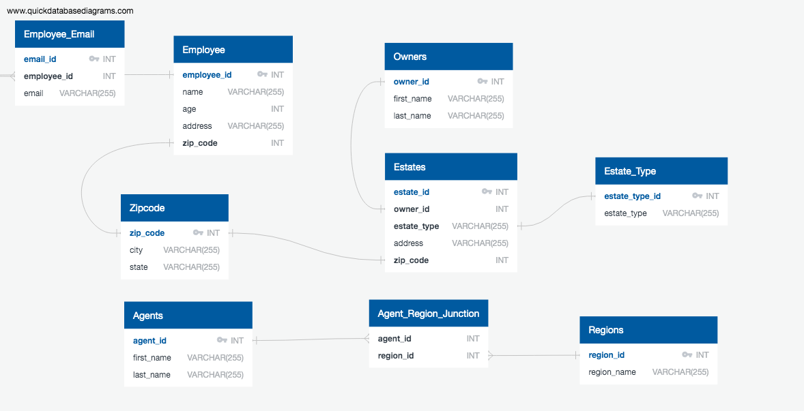

* If students need a refresher on data relationships, direct them to the documentation on the Quick Database Diagrams website following these steps.

* Click the Docs tab at the top of the page.

  

* Select Relationships from the drop-down menu. From this pane, an explanation of relationships and their symbols is provided.

  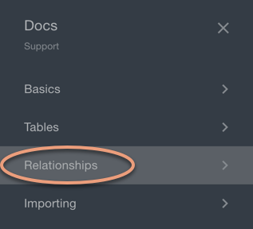

* Slack out [pagila-erd.png](Images/pagila-erd.png) to the class and open it on your computer. Point out how each table has a connection to at least one other table. For example:

* The `customer` and `customer_list` tables both contain `customer id` values.

* The `customer` table and `staff` table both contain `staff id` values.

* Understanding where and how entities are related allows developers to create more cohesive join operations.

</details>

<details>
  <summary><strong>✏️ 5.2 Partner Do: Designing an ERD, Part I (0:15)</strong></summary>

* Open the [slideshow](https://docs.google.com/presentation/d/1X72l_-j7OKOaploPA-8hLjoEn0e0O0iNHaVaty4qJxs/edit?usp=sharing) and use slides 38 and 39 to present this activity.

* In this activity, students will create a conceptual ERD for a gym owner.

  * **File:** [schema.txt](Activities/08-Par_Designing_ERD/Unsolved/schema.txt)

  * **Instructions:** [README.md](Activities/08-Par_Designing_ERD/README.md)

</details>

<details>
  <summary><strong>⭐ 5.3 Review: Designing an ERD, Part I (0:05)</strong></summary>

* Open the [slideshow](https://docs.google.com/presentation/d/1X72l_-j7OKOaploPA-8hLjoEn0e0O0iNHaVaty4qJxs/edit?usp=sharing) and use slide 40 to review the activity.

* **File:** [schema.txt](Activities/08-Par_Designing_ERD/Solved/schema.txt)

* Open the [Quick Database Diagrams (Quick DBD)](https://app.quickdatabasediagrams.com/#/) webpage and demonstrate the solution, using the code in the `schema.txt` file. Live code while explaining the following:

  * A conceptual diagram has only basic information, such as the names of the tables and their attributes.

  * Creating a diagram looks similar to writing code. For example, in the following image, `Gym` followed by the hyphen creates the table name within the diagram.

    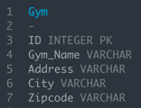

  * Transitioning a conceptual diagram to a logical diagram requires more information. Data types are defined and primary keys are established by adding ID rows to the tables, such as in the `Trainers` table:

    

    **Note**: Remember that the `PK` acronym stands for primary key.

* Copy and paste the remaining text from `schema.txt` to create the additional tables. The final product should appear as follows:

  

* Ask students if they created any other tables or connections, as there are many possible solutions in addition to those included here.

* Answer any questions before moving on.

</details>

<details>
  <summary><strong>✏️ 5.4 Partner Do: Designing an ERD, Part II (0:15)</strong></summary>

* Open the [slideshow](https://docs.google.com/presentation/d/1X72l_-j7OKOaploPA-8hLjoEn0e0O0iNHaVaty4qJxs/edit?usp=sharing) and use slides 41 - 43 to present this activity.

* In this activity, students will further improve on the ERD by creating a physical ERD.

  * **File:** [schema.txt](Activities/09-Par_ERD/Unsolved/schema.txt)

  * **Instructions:** [README.md](Activities/09-Par_ERD/README.md)

</details>

<details>
  <summary><strong>⭐ 5.5 Review: Designing an ERD, Part II (0:05)</strong></summary>

* Open the [slideshow](https://docs.google.com/presentation/d/1X72l_-j7OKOaploPA-8hLjoEn0e0O0iNHaVaty4qJxs/edit?usp=sharing) and use slide 44 to review the activity.

* **Files:**

  * [schema.txt](Activities/09-Par_ERD/Solved/schema.txt)

  * [query.sql](Activities/09-Par_ERD/Solved/query.sql)

* Open the [Quick Database Diagrams (Quick DBD)](https://app.quickdatabasediagrams.com/#/) webpage. Copy and paste the solution using the code in the `schema.txt` file and explain the following:

  * Transitioning a logical ERD to a physical ERD involves adding appropriate entities to tables and mapping their relationships.

  * For example, in the `Members` table, several rows were added to demonstrate data relationships. A row named `Gym_ID` was added as a foreign key (`FK`), establishing a one-to-many relationship by using the `>-` symbol.

  * A row containing the `Trainer_ID` was also added to demonstrate the one-to-many relationship between the members and trainers. While one member will have no more than one trainer, one trainer may instruct many members.

    ```sql
    Gym_ID INTEGER FK >- Gym.Gym_ID
    Trainer_ID INTEGER FK >- Trainers.Trainer_ID
    ```

  * The `Trainers` table also has a one-to-many relationship (`>-`) created by adding a `Gym_ID` row to the table. While a trainer will be employed at a single gym, the gym will employ many trainers.

    ```sql
    Gym_ID INTEGER FK >- Gym.Gym_ID
    ```

  * In the `Payments` table, a one-to-one relationship (`-`) is demonstrated by adding a `Member_ID` row and linking it to the `Members` table.

    ```sql
    Member_ID INTEGER FK - Members.Member_ID
    ```

  * Open the schema file with VS Code to view.

* Return to pgAdmin in the browser and create a new database called `gym`.

  * Open a query tool and paste in the newly downloaded SQL code to create the tables defined in the diagram.

  * Execute the code, and then check the table creation using a `SELECT` statement for each table.

    ```sql
    SELECT * FROM Trainers;
    SELECT * FROM Members;
    SELECT * FROM Gym;
    SELECT * FROM Payments;
    ```

* Answer any questions before moving on.

</details>

<sub>[Having issues with this activity? Report a bug!](https://bit.ly/2RaRiQV)</sub>

- - -

## 6. Unions

| Activity Time:       0:35 |  Elapsed Time:      4:00  |
|---------------------------|---------------------------|

**⏰ 3-Hour Adjustment**: Change activity to Everyone Do.

<details>
  <summary><strong>📣 6.1 Instructor Do: Introduction to Unions (0:10)</strong></summary>

* Open the [slideshow](https://docs.google.com/presentation/d/1X72l_-j7OKOaploPA-8hLjoEn0e0O0iNHaVaty4qJxs/edit?usp=sharing) and use slides 45 - 46 to present this lesson.

* **Files**:

  * [query.sql](Activities/10-Ins_Unions/Solved/query.sql)

  * [schema.sql](Activities/10-Ins_Unions/Solved/schema.sql)

* **Note:** Unions are perhaps a less crucial topic than some others covered in this lesson, so adjust the timing as you see fit.

* We are now back to using the `pagila` database for this first example.

* Remind students that when we perform joins, we bring columns from separate tables side by side.

* Explain we can also stack data vertically through an operation called `UNION`.

* Demonstrate how to get results from two tables without using joins; two different queries have to run:

  ```sql
  SELECT actor_id AS id, first_name
  FROM actor
  WHERE actor_id between 1 and 5;
  ```

  ```sql
  SELECT customer_id AS id, first_name
  FROM customer
  WHERE customer_id between 6 and 10;
  ```

* Explain that with unions these two queries can be combined. Demonstrate a simple union with the following:

  ```sql
  SELECT actor_id AS id, first_name
  FROM actor
  WHERE actor_id between 1 and 5

  UNION

  SELECT customer_id AS id, first_name
  FROM customer
  WHERE customer_id between 6 and 10;
  ```

  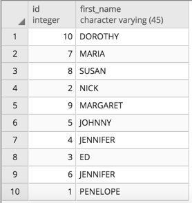

* Explain that by default, Postgres excludes duplicate entries from the result. Run the [schema.sql](Activities/10-Ins_Unions/Solved/schema.sql) in pgAdmin to load the example. Then run the following to show two separate queries:

  ```sql
  -- Union of toys and game types
  SELECT toy_id AS id, type
  FROM toys;
  ```

  ```sql
  SELECT game_id AS id, type
  FROM games;
  ```

* Then run `UNION` to show combined results.

  ```sql
  -- Union of toys and game types
  SELECT toy_id AS id, type
  FROM toys

  UNION

  SELECT game_id AS id, type
  FROM games;
  ```

* Explain that there are only four rows of data because the duplicates that fit the criteria are dropped. In cases where we want to display all duplicate entries, we can use the keywords `UNION ALL`.

  ```sql
  -- Include duplicate rows
  SELECT toy_id AS id, type
  FROM toys

  UNION ALL

  SELECT game_id AS id, type
  FROM games;
  ```

* Answer any questions before moving on to the activity.

</details>

<details>
  <summary><strong>✏️ 6.2 Student Do: Unions (0:15)</strong></summary>

* **Instructions**: [README.md](Activities/11-Stu_Unions/README.md)

* Open the [slideshow](https://docs.google.com/presentation/d/1X72l_-j7OKOaploPA-8hLjoEn0e0O0iNHaVaty4qJxs/edit?usp=sharing) and use slides 47 and 48 to introduce to this activity.

* This activity will give students more practice with unions, by combining data from multiple tables without the use of joins.

</details>

<details>
  <summary><strong>⭐ 6.3 Review: Unions (0:10)</strong></summary>

* Open the [slideshow](https://docs.google.com/presentation/d/1X72l_-j7OKOaploPA-8hLjoEn0e0O0iNHaVaty4qJxs/edit?usp=sharing) and use slide 49 to review the activity.

* **File:** [Activities/11-Stu_Unions/Solved/unions.sql](Activities/11-Stu_Unions/Solved/query.sql)

* The first problem simply requires the union of the `COUNT` of rows from `city` and `country`.

  ```sql
  SELECT COUNT(*)
  FROM city
  UNION
  SELECT COUNT(*)
  FROM country;
  ```

* The second problem requires a bit more work. In the proposed solution, customer IDs from the `customer` and `customer_list` tables are brought together with `UNION ALL`.

  ```sql
  SELECT customer_id
  FROM customer
  WHERE address_id IN
  (
    SELECT address_id
    FROM address
    WHERE city_id IN
    (
      SELECT city_id
      FROM city
      WHERE city = 'London'
    )
  )
  UNION ALL
  SELECT id
  FROM customer_list
  WHERE city = 'London';
  ```

  * Customer IDs from `customer_list` can simply be narrowed down with `WHERE city = 'London'`.
  * To retrieve customer IDs from the `customer` table, subqueries are performed across `address` and `city` tables.

</details>

<sub>[Having issues with this activity? Report a bug!](https://bit.ly/2JAZZ2X)</sub>

- - -

### Copyright

© 2019 Trilogy Education Services
